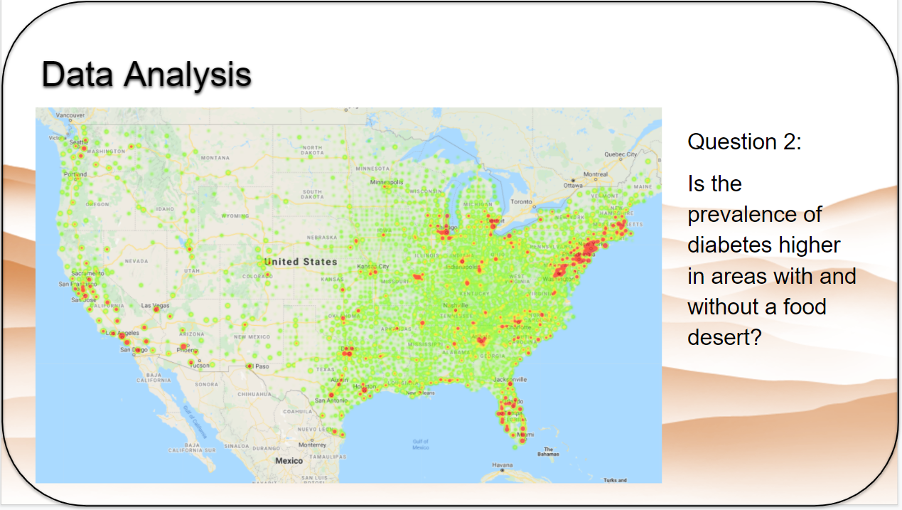

# Food Deserts

## Table of contents
* [Summary](#summary)
* [Data Sources](#data_sources)
* [Data Cleanup](#data_cleanup)
* [Data Analysis](#data_analysis)
* [Obesity](#obesity)
* [Diabetes](#diabetes)
* [Ethnicities](#ethnicities)
* [Conclusion](#conclusion)
* [Post Mortem](#post_mortem)
* [Sources](#sources)
* [Notebooks](#notebooks)

## Summary

## Data Sources

## Data Cleanup

## Data Analysis 

## Obesity

## Diabetes 

## Ethnicities

## Conclusion

## Post Mortem 

## Sources

Presentation Link:

https://drive.google.com/file/d/1niunvaodJr-CGRVTnK50VF2Tku2iLLeI/view?usp=sharing

Health Data: 

https://www.countyhealthrankings.org/explore-health-rankings/rankings-data-documentation/national-data-documentation-2010-2018

Food Desert Data: 

https://www.ers.usda.gov/data-products/food-access-research-atlas/download-the-data/

County Coordinates:

https://public.opendatasoft.com/explore/dataset/us-county-boundaries/map/?location=5,69.03242,-35.00244&basemap=jawg.streets

Medicare and Medicaid Services (CMS): 

https://www.cms.gov/Research-Statistics-Data-and-Systems/Statistics-Trends-and-Reports/CMSProgramStatistics/2017/2017_Main

## Notebooks and Analysis Discussions

Bar Charts -
https://github.com/Ssimoes48/project_1_superstars/blob/main/BarGraphForloop.ipynb
README_bar_graphs_TB.md

Scatter Plots - 
https://github.com/Ssimoes48/project_1_superstars/blob/main/scatter_plots.ipynb
README_scatters_KL.md

Pie Plots - 
https://github.com/Ssimoes48/project_1_superstars/blob/main/Pie_Plots_Final.ipynb
README_pie_plots_RC.md

Map Data - 
https://github.com/Ssimoes48/project_1_superstars/blob/main/map_data.ipynb
README_map_data_SS.md

 
