# Pie Plots
> An analysis of food deserts and health effects associated with them using pie and donut charts.

## Table of contents
* [General info](#general-info)
* [US Pie Charts](#us-pie-charts)
* [Montana Pie Charts](#montana-pie-charts)
* [Sources](#sources)

## General info
To begin our analysis, we gathered data split up by census tract. We found information on factors such as diabetes, medicare enrollment, obesity, race, and self-reported fair/poor health, all distinguished by census data. We then merged the datasets and began studying the data. For the pie/donut chart visualization, I used Python, Pandas, and Matplotlib to split, analyze, and visualize the data.

One important variable included in the County Healthy Rankings was the Food Environment Index, which I used to categorize food deserts and non food deserts. This index weighs access to healthful foods and income, and rates each county on a scale from 0 (worst environment) to 10 (best environment). Although there was no clear cutoff point to define a food desert, I wanted to find a rough indicator for comparison purposes. According to a USDA article, the USDA's Food Desert Locator considered 10% of the US census population as food desert residents1. Based off of this information, I calculated the 10% quantile, which returned a value of 5.5. I then used this value to designate counties as food deserts and non food deserts.

## US Pie Charts
I used the binning function to first bin the counties into food deserts and non food deserts, and then to group any calculations according to the binned categories.
For example, I used the following code to:
1) Bin the counties based on the environment categories (food/non food desert)
2) Calculate the Poor/Fair Health population and split the data according to environment category
3) Create a dataframe to hold the data for analysis and visualization

`#Creating a column for food environment categories
combined_df["Environment Category"] = binned_if_desert
combined_df.reset_index(drop=True,inplace=True)`

`#Creating series for each parameter. Calculating the average fair/poor health rate in each environment.
poor_health_average = combined_df.groupby("Environment Category")["% Fair/Poor"].mean()`

`#Create dataframe to hold data
poorhealth_byenv_df = pd.DataFrame(
    {"Fair/Poor Health Rate Average": poor_health_average})
poorhealth_byenv_df`

Below are the results of the nationwide pie chart analysis:

Obesity Rates:
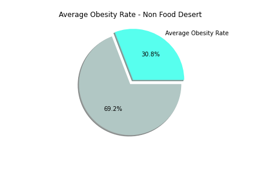
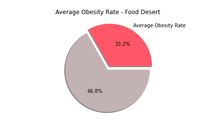

Diabetes Rate:
The variable provided in the County Health Rankings reported the number of diabetics enrolled in Medicaid. For calculation purposes, we merged the Medicaid enrollment data in order to find the percentage of diabetics enrolled in Medicaid.
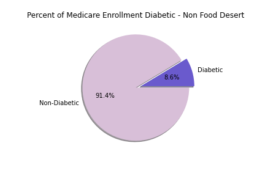
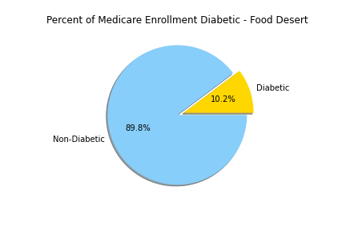

% Fair/Poor Health:
Age adjusted percentage of adults reporting fair or poor health.
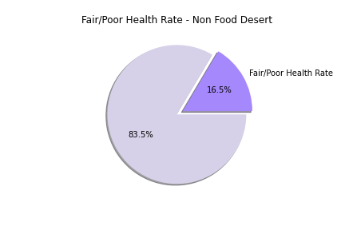
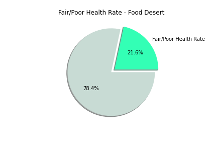

Racial Distribution:
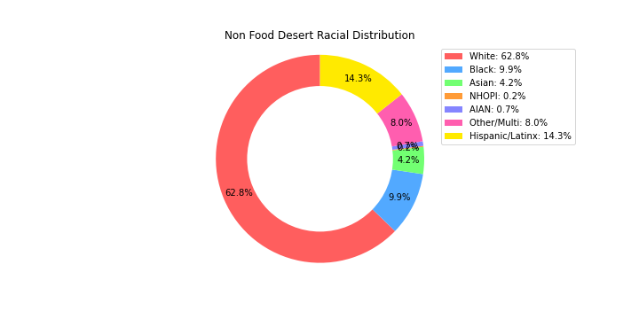
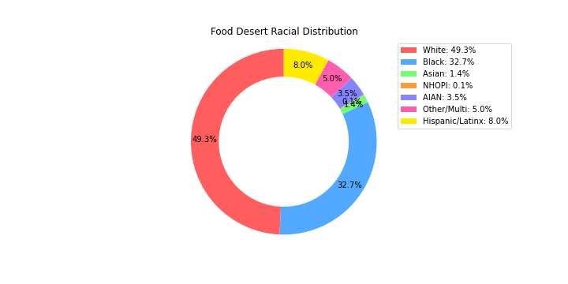

## Montana Pie Charts
Non Food Desert (Fergus) vs Food Desert (Big Horn):

Obesity Rates:
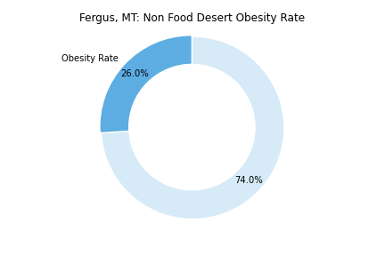
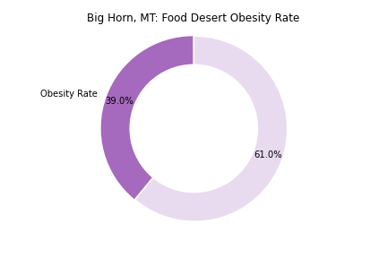

Diabetes Rates:
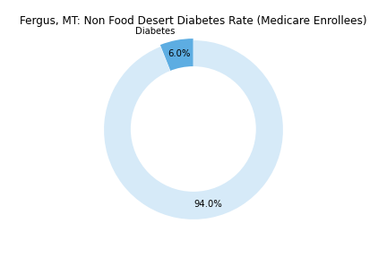
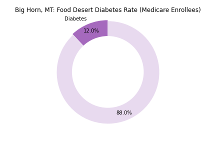

% Fair/Poor Health:
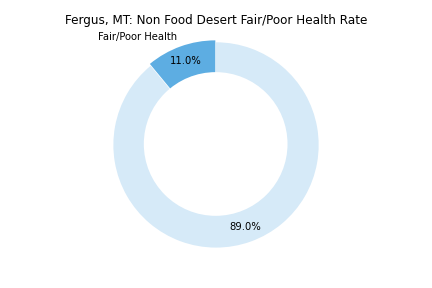
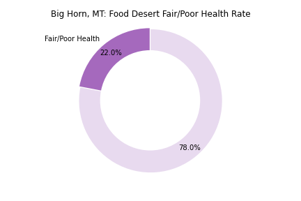

Racial Distribution:
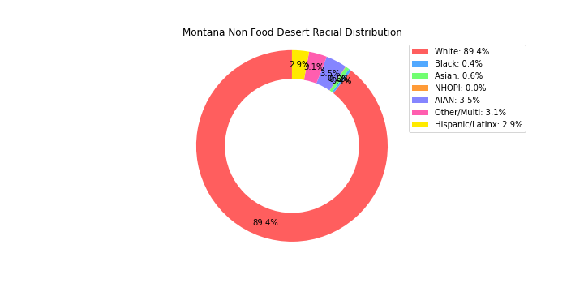
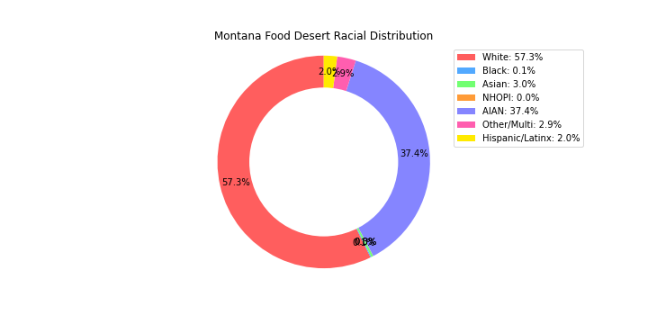

## Conclusion

The pie and donut charts displayed differences between the designated food deserts and non food deserts. The nationwide analysis demonstrated a 2.4 percentage point difference in obesity, a 5.1 percentage point difference in fair/poor health rate, and a 1.6 percentage point difference in diabetes rate (for medicare enrollees). The differences were slight but expected, as we hypothesized that food desert residents would be afflicted by reduced health status.

The health differences between the two Montana counties were more significant. There was a 13 percentage point difference in obesity rate, a 6 percent difference in diabetes rate (for medicare enrolles), and a 11 percentage point difference in fair/poor health rate between the two counties.

Although not directly related to health, we thought it would be worthwhile to look into the racial makeup of the US and Montana (again binned by food desert and non food desert). Our findings demonstrated a significantly higher black population (by 23 percentage points) in food deserts on a nationwide scale. When analyzing statewide data for Montana, we found that there was a 34 percentage point difference in American Indian and Alaska Native population (the higher representation in food deserts).

## Limitations

The most difficult part of this project was determining what could be considered a food desert, and how we could designate them using the data. Although the Food Environment Index was a great measure, we could have benefited from data that denoted counties that were food deserts or information on cutoff points.

## Sources
1 USDA, https://www.usda.gov/media/blog/2011/05/03/interactive-web-tool-maps-food-deserts-provides-key-data
