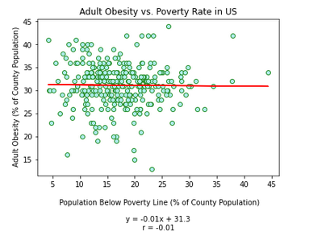

# Project Name:  Food Deserts and Health in America

## Table of contents
* [Background](#background)
* [Scatter Plot and Linear Regression Analysis](#scatter_plots)
* [Initial Evaluation](#initial_eval)
* [Revised Approach](#revised_approach)
* [Interim Results Evaluation](interim_eval)
* [Alternate Analysis](alt_anal)
* [Final Results](final_results)
* [Limitations](limitations)
* [Resources](resoures)

## Background

The idea of a food desert is significant in that it drives policy planning and certain funding efforts related to 
underpriveleged communities.  We hypothesized that the presence of a food desert results in decreased health status 
for residents of that area. To research this, we asked the following investigative questions: 

1. Is the incidence of diabetes more common in residents living in a food desert than those outside of one?
2. Is the incidence of obesity more common in residents living in a food desert than those outside of one?

A Food Desert can generally be defined as a community with reduced access to healthy food, as measured by distance to 
a supermarket. Poverty level is also considered.  

As a research team, we analyzed the data through several methods, including the use of pie charts, bar charts, scatter 
plots, and heat maps for various hypothetical data relationships.  Our first approach involved the assessment of both health 
factors and socioeconomic factors related to access to healthy foods. However, our analytical approach and evaluation morphed
as we gained understanding of the data. Data evaluation summaries for pie charts, bar charts, and heat maps are presented in 
separate readme files. This summary includes the scatter plot and linear regression analysis.  

## Scatter Plot and Linear Regression Analysis

To confirm that each was utilizing the most robust dataset possible, for each scatter plot I created a separate dataframe 
based on all rows in common between the two desired columns/fields.  

## Initial Evaluation 

- % Adult Obesity as a function of % Poverty Rate (% of county population below the poverty line) 
- No. Diabetic Medicare Enrollees Per County as a function of % Poverty Rate 
- No. Deaths Per County as a function of % Poverty Rate (% of county pop below the poverty line) 
- % Adult Obesity as a function of Food Environment Index Rating
- No. Diabetic Medicare Enrollees Per County as a function of Food Environment Index Rating
- No. Deaths Per County as a function of Food Environment Index Rating

However, in performing these analyses, I noticed that using total number counts per county (i.e. for diabetes and deaths)
was not appropriate: a more populous county may have many more deaths than a less densely populated county; but in relation 
to the total population, the proportion of deaths could actually be higher in a less populous county.  Therefore, percents 
were calculated to normalize the count data to the population. I calculcated percentages and added them as columns to the 
dataframe, as follows (not all were used, but could be used in future analysis):

	data_df["% Diabetics"] = pct_diab
	data_df["% Deaths"] = pct_dead
	data_df["% Violent Crimes"] = pct_crime
	data_df["% Unemployed"] = pct_unemp
	data_df["% TractSNAP"] = pct_snap
	data_df["% LAPOP1_10"] = pct_LAPOP1_10

Note that LAPOP1_10 is a field included in the original census tract data, which identified people who live in an urban
area more than one mile to a supermarket, or in a suburban/rural area more than 10 miles from a supermarket. The Food 
Environmnent Index (FEI) provided a similar indication of access to healthy foods, and as such, FEI was selected for 
scatter plotting (as discussed in the Alternate Analysis section below).  

I reran the initial relationships that had utilized counts, replacing those series with percentages instead. I also 
attempted to reduce the number of points on plots by using a random sample function, selecting 300 datapoints 
(approximately 10 to 20% of dataset), although the results were no more or less visually appealing. The results of these
analyses did not suggest a strong correlation between any of the relationships, as suggested by the obesity results below: 

## Revised Approach

In an attempt to see the data in a different light, I then split up our dataset into two dataframe to represent counties 
that would be considered food deserts, or non-food deserts using the following logic:  

- Per USDA, approximately 10% of census tracts are food deserts. We therefore estimated that approximately 10% of our 
	counties would be food deserts, and got the Food Environment Index (FEI) ratings of the bottom 10% of counties.  
- For the FEI, a rating of 0 indicates most difficult access to healthy foods, while a rating of 10 indicates the easiest.   
- Separate dataframes were created to evaluate food deserts (data for counties with bottom 10% of FEI ratings) and 
	non-food deserts (data for counties with top 90% of FEI ratings)

I then repeated each of the analyses combinations above for the two groups (food desert and non-food desert), and added
the following relationship:

- % Adult Obesity as a function of Unemployment (% of County Population) 

The results of these analyses are presented below:  

### Incidence of Obesity: 

### Incidence of Diabetes: 

### Incidence of Death: 

### Unemployment:

## Interim Results Evaluation

The interim results of the scatter plots and linear regression analysis did not suggest a strong correlation 
between any of the relationships. Correlation coefficients (in absolute value) ranged from 0.0 to 0.4, with
the lowest and highest at the following: 
- The % of Deaths as a function of % Population below the poverty line in Non-Food Deserts had a correlation 
	coefficient of 0.0.  
- The % of Deaths as a function of % Population below the poverty line in Food Deserts had a correlation 
	coefficient of 0.4.  
Although it appeared there were measureable differences in the incidence of death inside versus outside food 
deserts, the overall correlation coefficients were not strong enough to support statistical significance.  

## Alternate Analysis

Given that the results of these analysis did not seem to support a statistically significant relationship, further 
analysis of these comparisons was abandoned.  After regrouping, we approached the data in a different way to further
evaluate whether any correlations existed. Additionally, we noticed that in the state of Montana, the data seemed to 
suggest some relationship between % obesity, % diabetes, and demographic racial distribution inside and outside of food 
deserts. Therefore, I utilized the original dataframe with all data (both food and non-food deserts), and focused on 
evaluating the following possible relationships in the US overall, and in Montana: 

- % Incidence of Adult Obesity as a function of Food Environment Index in the US
- % Incidence of Adult Obesity as a function of Food Environment Index in Montana
- % Incidence of Diabetes as a function of Food Environment Index in the US
- % Incidence of Diabetes as a function of Food Environment Index in Montana

As a supplemental analysis, I also investigated the use of food stamps as a socioeconomic factor potentially related to 
living in a food desert. Charts of these analysis are provided below (excluding the evaluation of racial distribution 
which was was performed using pie charts and is discussed in a separate summary). 

### Obesity as a Function of FEI: 

### Diabetes as a Function of FEI: 

### Food Stamp Use as a Function of FEI: 

## Final Results

While possible minor trends were identified in the relationships for obesity and diabetes above, again, the correlation 
coeffiecents (in absolute value) ranged only from 0.17 to 0.27, indicating that there is no statistically significant 
dependency of incidence of these health factors as a function of the Food Environment Index.  This suggests that regardless 
of easy or difficult access to healthy food, the number of people with diabetes and the number of people with obesity does 
not change. Therefore, we cannot reject the null hypothesis.

In relation to food stamps, the data showed a slightly higher correlation between the use of food stamps and FEI in the US 
as a whole (r = 0.40), versus the use of foodstamps and FEI in Montana (r = 0.0).  This suggests a possible difference 
between these two populations.  However, the correlation coefficients were still too low to prove the alternative 
hypothesis.   

## Limitations

Available health data did not parse characteristics to the census tract level, while the food desert data did.  We utilized 
the Food Environment Index because it was the best indicator for access to healthy food at the county level. While our 
analysis did not show statistically signifiant relationships, there were minor trends suggesting that a more detailed 
analysis could provide a different result. Heath data (e.g. for obesity and diabetes) specific to a census tract could prove 
more valueable in determining whether a relationship between health effects and food deserts exists.     

## Resources

- Health Data: https://www.countyhealthrankings.org/explore-health-rankings/rankings-data-documentation/national-data-documentation-2010-2018
- Food Desert Data: https://www.ers.usda.gov/data-products/food-access-research-atlas/download-the-data/
- County Coordinates: https://public.opendatasoft.com/explore/dataset/us-county-boundaries/map/?location=5,69.03242,-35.00244&basemap=jawg.streets
	

