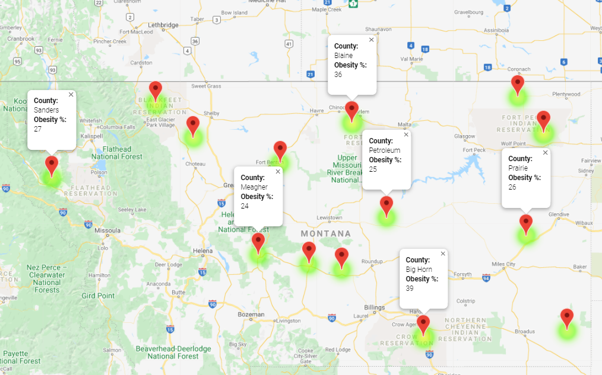
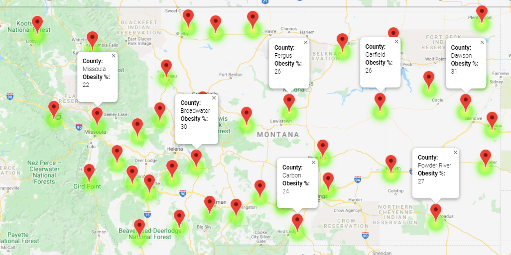
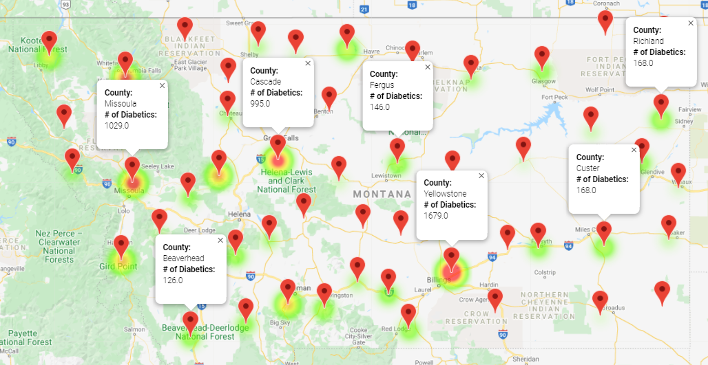
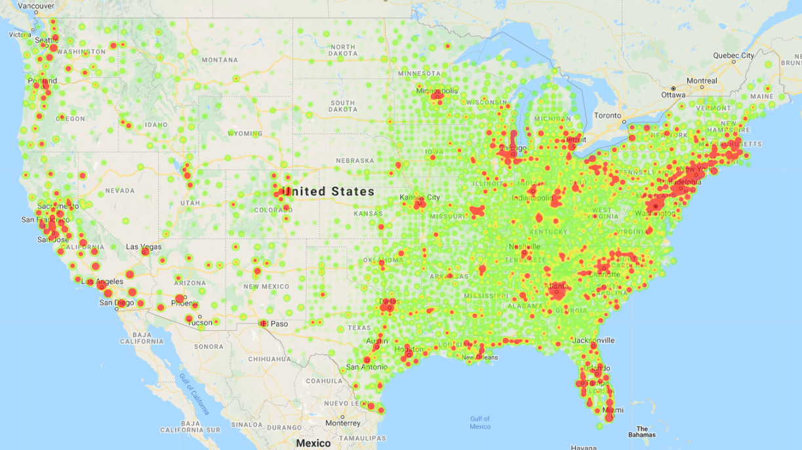

# Food Desert Analysis : Map Data

## Table of contents
* [General info](#general-info)
* [US Maps](#us_maps)
* [Montana Maps](#montana_maps)
* [Obesity](#obesity)
* [Diabetes](#diabetes)
* [Unemployment](#unemlpoyment)
* [Conclusion](#conclusion)
* [Sources](#sources)

## General info

To analyze our data to visualize % of Obesity, # of Diabetics and Unemployment rate, we first needed to merge the data. We used `pd.DataFrame.merge` to merge four `csv` files combining information on Food Deserts, Health information my county, Medicare enrolment by county and map coordinates by county. With the final `dataframe`, I was able to show with `G-Maps API` the locations of all counties the US with the `heat layers` of different variables related to our data. 

## US Maps

By calling the gmap API I was able to print a map of the US showing a point for every county int the USA with a `heat layer` on the “Food Environment Index”. This Index is a rating of 0 to 10 showing the availability to food, thus showing the locations of Food Deserts. In an urban area, if you are more than 1 mile from a supermarket or 10 miles in a suburban area, it is considered a Food Desert. 

Because the index showed the value rating of 0 to equal Low access to food and 10 to show easy access to food, I had to invert the index value so that when I plotted it as a `heat layer` the ‘red’ showed Food Deserts for easy reference. 
To do this, I used an absolute value function to inverse the rating value: 
`clean_data2["Inverse Index"] = clean_data2["Food Environment Index"].apply(lambda x: abs(x - 10))`

Below is a map of the US by county with a `heat layer` on the “Food Environment Index” (inverse)

This map shows the `heat layer` for Obesity Percent per county. 

This map shows the `heat layer` for Number of Diabetic people per county. 

## Montana Maps

We decided to deep dive on the state of Montana because it was a good representation of the Data and was easy to visualize the differences between Food Deserts and Non-Food Deserts. 

Below is an image of Montana with a `heat layer` of the “Food Environment Index”
` heat_layer = gmaps.heatmap_layer(locations, weights=food_env, dissipating=False, max_intensity=10, point_radius=.25)`

## Obesity

To evaluate Obesity rates within and out of Food Deserts I split my data into 2 `dataframes` based on their “Food Environment Index”. Based on formulations made by my group, we determined that to categorize a food desert, the “Food Environment Index” would be equal to or less than 5.5 out of 10.

To better understand the data, I `printed` the `dataframe` of Montana and used the `.count() ` function to count the total number of counties and how many food deserts there were. Montana has 56 counties and out of those, 33 are rated as Food Deserts. 

Below is a map of Montana with a `heat layer` of Percent of Obesity by county in Food Deserts. I added a `marker layer` to show the County Name and % Obese” for each pin drop.  

Below is a map of Montana with a `heat layer` of Percent of Obesity by county of Non-Food Deserts. 

## Diabetes

I used the same `dataframes` to show the number of Diabetic people registered for Medicare per county. If we had more time, I should have converted this number into a percentage to better illustrate the relationship, or lack of relationship. 

Below is a map of Montana with a `heat layer` of Number of Diabetics per county in Food Deserts. I added a `marker layer` to show the County Name and “# of Diabetics” for each pin drop.  

Below is a map of Montana with a `heat layer` of Number of Diabetics per county in Non-Food Deserts. 

## Unemployment

We did not have time to deep dive into Unemployment totals as they related to being in a food desert or non-food desert, but I created maps to show the data. Below is a map of all US counties with a `heat map` layer of Unemployment Totals per county. I set the index to 3000 to better illustrate the results. 

Below is a map of Montana with a `heat layer` of Unemployment total per county. I added a `marker layer` to show the County Name and “% of Unemployed” for each pin drop.  We did not have time to break up this evaluation by food deserts and non-food deserts or to convert the number of unemployed into a percentage by population.  

## Conclusion

In conclusion, we found that there was not a significant relationship between Obesity and Diabetes if you reside within a food desert or not in a food desert. Our scatter plots which can be found in the Scatter Plot portion of this repo show slight line regression as it relates to Obesity so that leads us to conclude there is some correlation, however not as much as we hypothesized. 

Challenges we faced with the Map images to display our results were that unless you were able to show the contrast of Food Deserts to Non-Food Deserts, the maps just showed information per county. As our project evolved, separating our `dataframe` into a Desert and Non-Desert set of data was the best way to show the difference between the results. 

The US maps were helpful tools to visualize the entire state to locate areas of interest to further deep dive. IF we had more time, we would have chosen a sample of States to analyze further and not just one. 

## Sources

Google Maps API 

Health Data: 
https://www.countyhealthrankings.org/explore-health-rankings/rankings-data-documentation/national-data-documentation-2010-2018

Food Desert Data: 
https://www.ers.usda.gov/data-products/food-access-research-atlas/download-the-data/

County Coordinates:
https://public.opendatasoft.com/explore/dataset/us-county-boundaries/map/?location=5,69.03242,-35.00244&basemap=jawg.streets

Medicare and Medicaid Services (CMS):

