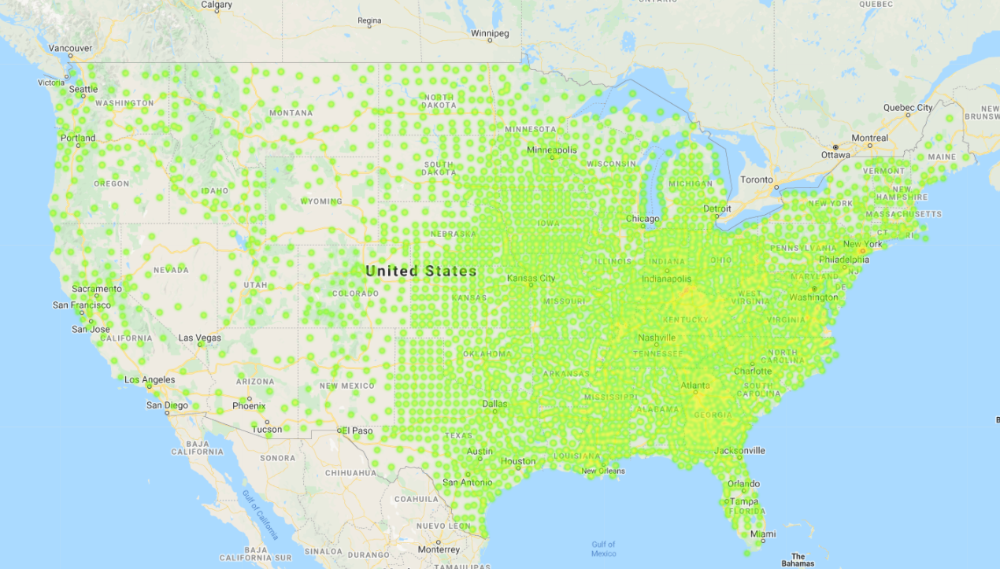

# Food Desert Analysis : Map Data

## Table of contents
* [General info](#general-info)
* [US Maps](#us_maps)
* [Montana Maps](#montana_maps)
* [Obesity](#obesity)
* [Diabetes](#diabetes)
* [Unemployment](#unemlpoyment)
* [Conclusion](#conclusion)
* [Sources](#sources)
* [Contacts](#contacts)

## General info

## US Maps

## Montana Maps

## Obesity

## Diabetes

## Unemployment

## Conclusion

## Sources

## Contacts
Sara Simoes

